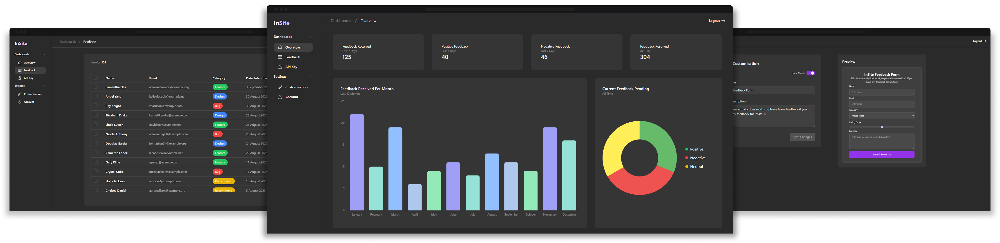

# InSite

InSite is a modern, user-friendly feedback collection system designed to help website owners gather, manage, and analyze user feedback efficiently.




## Usage

1. Register an account at https://insite-eta.vercel.app/register
2. Access your dashboard to get your API key
3. Customize your feedback form appearance
4. Integrate the widget into your website
5. Start collecting and managing feedback!

### Integration

To add the feedback widget to your website, copy the following code and replace `{apiKey}` with your actual API key from the dashboard:

```html
<a 
    href="https://insite-eta.vercel.app/form/{apiKey}"
    target="_blank"
    style="
        display: inline-block;
        padding: 8px 16px;
        background-color: #9333ea;
        color: white;
        border-radius: 50px;
        text-decoration: none;"
>
    Feedback
</a>
```

## Features

- **Customizable Feedback Form**: Offers light/dark mode options, customizable titles and descriptions, multi-category feedback collection, and a rating system with visual indicators.

- **Interactive Dashboard**: Provides real-time feedback statistics, visual analytics with charts, and tools for filtering, sorting, and managing feedback comprehensively.

- **Secure Authentication**: Features email/password authentication, account management, and a secure API key system to protect user data.

- **Easy Integration**: Includes a simple HTML snippet for integration, responsive design, and cross-browser compatibility to ensure seamless usage.

## View Live
This app is live at: https://insite-eta.vercel.app/
