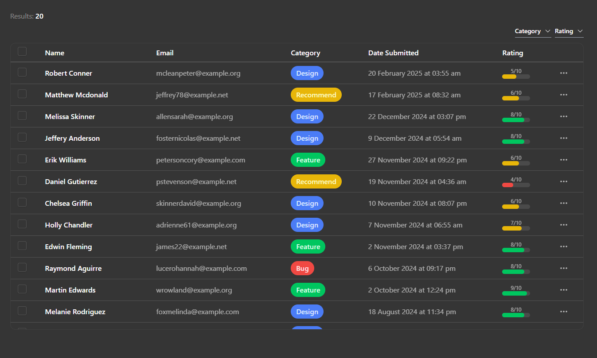

# InSite - Website Feedback System


InSite is a modern, user-friendly feedback collection system designed to help website owners gather, manage, and analyze user feedback efficiently. With an easy-to-integrate widget and comprehensive dashboard, InSite makes it simple to understand your users' needs and improve your website experience.



## Features

- 🎨 **Customizable Feedback Form**
  - Light/Dark mode options
  - Customizable form title and description
  - Multi-category feedback collection
  - Rating system with visual indicators

- 📊 **Interactive Dashboard**
  - Real-time feedback statistics
  - Visual analytics with charts
  - Feedback filtering and sorting
  - Comprehensive feedback management system

- 🔒 **Secure Authentication**
  - Email/Password authentication
  - Account management features
  - Secure API key system

- 🔌 **Easy Integration**
  - Simple HTML snippet integration
  - Responsive design
  - Cross-browser compatibility

## Usage

1. Register an account at https://insite-eta.vercel.app/register
2. Access your dashboard to get your API key
3. Customize your feedback form appearance
4. Integrate the widget into your website
5. Start collecting and managing feedback!

### Integration

To add the feedback widget to your website, copy the following code and replace `{apiKey}` with your actual API key from the dashboard:

```html
<a 
    href="https://insite-eta.vercel.app/form/{apiKey}"
    target="_blank"
    style="
        display: inline-block;
        padding: 8px 16px;
        background-color: #9333ea;
        color: white;
        border-radius: 50px;
        text-decoration: none;"
>
    Feedback
</a>
```

## View Live
This app is live at: https://insite-eta.vercel.app/